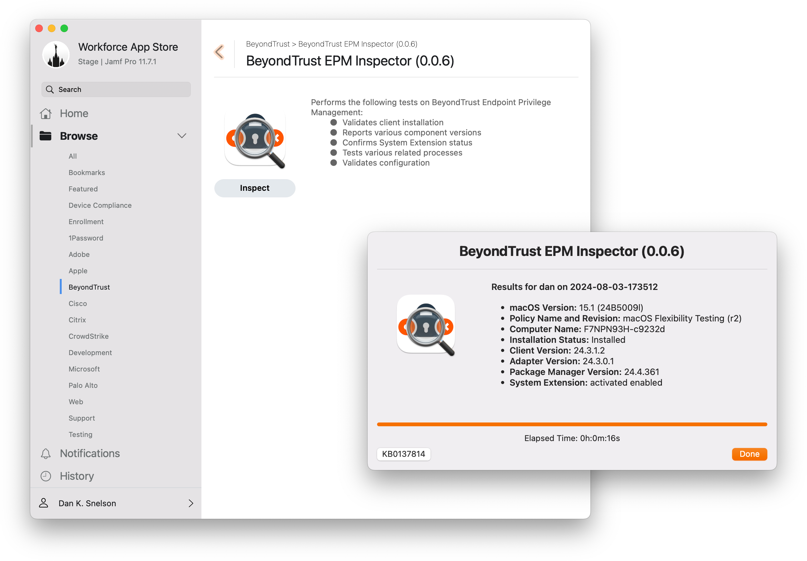

# BeyondTrust Endpoint Privilege Management

## Vendor Overview

BeyondTrust Endpoint Privilege Management allows organizations to:

> Enforce least privilege dynamically to prevent malware, ransomware, and identity-based attacks, achieve compliance across Windows, macOS, and Linux endpoints, and enable your zero trust strategy — without compromising on productivity. [Learn more](https://www.beyondtrust.com/products/endpoint-privilege-management)

---

## [BeyondTrust EPM Flexibilities.zsh](BeyondTrust%20EPM%20Flexibilities.zsh)
> Easily assign macOS computers to a BeyondTrust Endpoint Privilege Management High, Medium or Low Workstyle Flexibility via a Jamf Pro Script Parameter

While BeyondTrust Endpoint Privilege Management for Windows policy Workstyles can be filtered based on Microsoft Entra ID groups — as of this writing — macOS policy Workstyles cannot. For macOS, each users’ account must be added to an existing local group for every Mac in your fleet.

[Continue reading …](https://snelson.us/2024/08/beyondtrust-epm-flexibilities/)

---

## [BeyondTrust EPM Inspector.zsh](BeyondTrust%20EPM%20Inspector.zsh)
> Leverage swiftDialog to display a user-friendly message about the health of BeyondTrust Endpoint Privilege Management for Mac, while capturing various under-the-hood settings behind-the-scenes

During a recent case with BeyondTrust Support, we were asked to obtain the output of several elevated Terminal commands from the affected user’s Mac.

While certainly not a replacement for CaptureConfig.app, BeyondTrust EPM Inspector.zsh allows affected end-users to self-diagnose EPM-related issues and captures its output to a Jamf Pro Policy Log, which can be easily shared with BeyondTrust Support representatives, without the “let’s-schedule-a-remote-support-session” requirements of the CaptureConfig.app.

[Continue reading …](https://snelson.us/2024/08/beyondtrust-epm-inspector/)

---

## [BeyondTrust EPM: Racing Stripes](https://snelson.us/2024/08/beyondtrust-epm-racing-stripes/)

> A collection of racing stripes for BeyondTrust Endpoint Privilege Management on macOS

The following racing stripes proved helpful in our initial deployment and ongoing support of BeyondTrust Endpoint Privilege Management for macOS.

[Continue reading …](https://snelson.us/2024/08/beyondtrust-epm-racing-stripes/)

---

## Scripts
### [BeyondTrust EPM Health.bash](BeyondTrust%20EPM%20Health.bash)
> A Jamf Pro Extension Attribute which determines the health of BeyondTrust Privilege Management for Mac

### [Setup Your Mac Validation: BeyondTrust Privileged Access Management.bash](https://github.com/setup-your-mac/Setup-Your-Mac/blob/main/Validations/BeyondTrust%20Privileged%20Access%20Management.bash)
> A script which determines the health of BeyondTrust Privilege Management for Mac

### [Local Administrative Rights Remove.bash](Local%20Administrative%20Rights%20Remove.bash)
> Removes admin rights from adminstrators NOT specificially listed in `approvedAdmins`